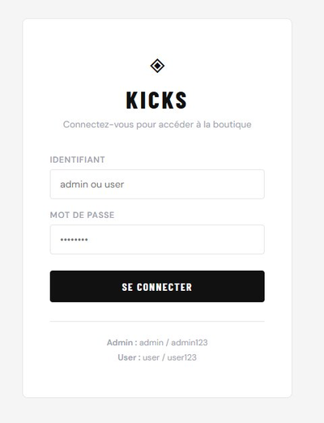
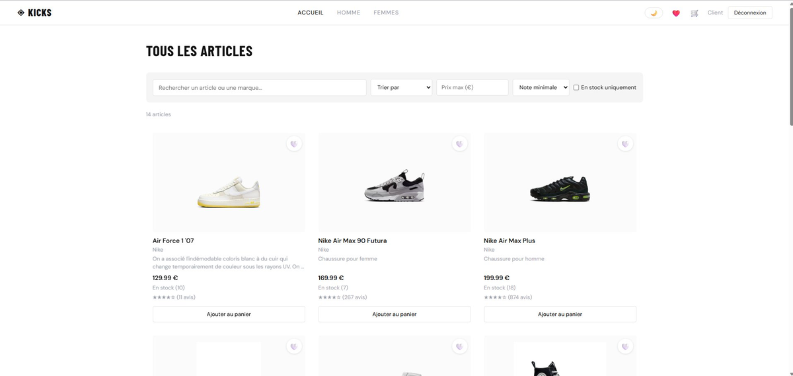
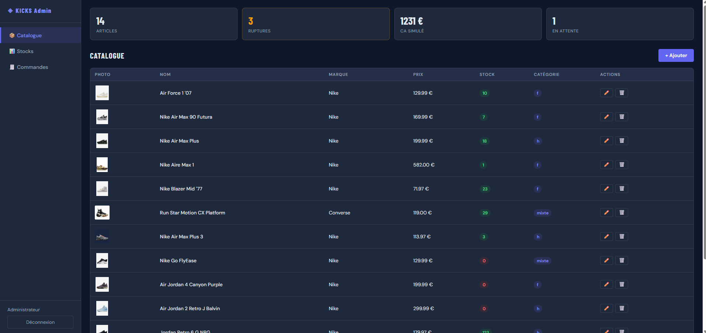
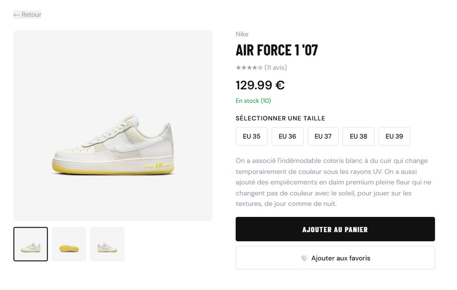
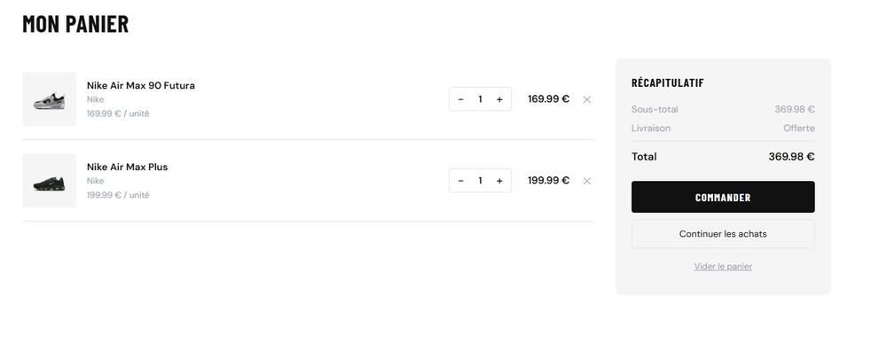
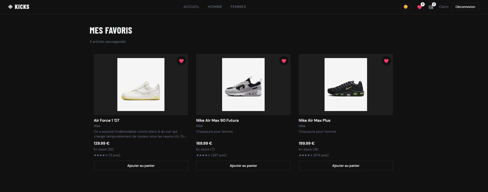

# KICKS — Boutique de sneakers en ligne

> Application e-commerce React complète avec authentification par rôles, panier, favoris, dark mode et dashboard administrateur.

---

## 📸 Aperçu

| Page login | Boutique user | Dashboard admin |
|:---:|:---:|:---:|
|  |  |  |

| Fiche produit | Panier | Dark mode |
|:---:|:---:|:---:|
|  |  |  |

---

## ✨ Fonctionnalités

### 🔐 Authentification & Rôles
- Page de connexion comme point d'entrée unique
- Deux comptes simulés : **admin** et **user**
- Redirection automatique selon le rôle après connexion
- Routes protégées — accès impossible sans être connecté
- Dashboard "Admin" visible uniquement pour l'administrateur

### 🛍️ Boutique (côté user)
- Catalogue complet avec grid responsive 3 colonnes
- **Barre de recherche** par nom ou marque
- **Filtres** : prix maximum, note minimale, en stock uniquement
- **Tri** : prix croissant/décroissant, meilleures notes
- Cartes produit cliquables avec skeleton loaders au chargement
- **Fiche produit** : galerie d'images interactive, sélecteur de taille obligatoire
- **Panier** : ajout/suppression, quantités, livraison offerte dès 100 €
- **Checkout** en 3 étapes : livraison → paiement → confirmation
- **Page favoris** avec compteur dans la navbar
- **Dark mode** avec toggle persisté dans localStorage
- Design épuré inspiré de Nike.com

### 🖥️ Dashboard Admin
- Sidebar de navigation dédiée
- **KPIs** : nombre d'articles, ruptures de stock, CA simulé, commandes en attente
- **Catalogue** : tableau complet avec ajout, modification et suppression d'articles
- **Gestion des stocks** : ajustement + / − par article avec indicateurs visuels
- **Commandes** : liste simulée avec statuts colorés

### 📱 Responsive & UX
- Adapté mobile, tablette et desktop
- Skeleton loaders sur toutes les pages catalogue
- Page 404 avec redirection intelligente selon le rôle
- Dark mode complet sur toute l'interface user

---

## 🛠️ Stack technique

| Technologie | Usage |
|---|---|
| **React 18** | UI et composants |
| **Vite** | Bundler et dev server |
| **React Router v6** | Navigation et routes protégées |
| **Context API + useReducer** | État global (panier, favoris, auth, thème) |
| **CSS custom properties** | Design system et dark mode |
| **localStorage** | Persistance panier, favoris, session, thème |

---

## 🚀 Installation rapide

### Prérequis
- **Node.js** v16 ou supérieur — [télécharger](https://nodejs.org/)
- **npm** v8 ou supérieur (inclus avec Node.js)

### Étapes

```bash
# 1. Cloner le dépôt
git clone https://github.com/YamiUtsukushi/Boutique-d-articles-en-ligne.git

# 2. Aller dans le répertoire
cd Boutique-d-articles-en-ligne

# 3. Installer les dépendances
npm install

# 4. Lancer en développement
npm run dev
```

L'application s'ouvre sur **http://localhost:5173**

### Comptes de test

| Rôle | Identifiant | Mot de passe | Accès |
|---|---|---|---|
| Administrateur | `admin` | `admin123` | Dashboard + gestion catalogue |
| Utilisateur | `user` | `user123` | Boutique complète |

---

## 📁 Structure du projet

```
src/
├── App.jsx                    # Routing principal
├── App.css                    # Design system complet
│
├── context/
│   ├── AuthContext.jsx        # Authentification et rôles
│   ├── ShopContext.jsx        # Panier et favoris
│   └── ThemeContext.jsx       # Dark mode
│
├── components/
│   ├── Navbar.jsx             # Barre de navigation user
│   ├── ProductCard.jsx        # Carte produit réutilisable
│   ├── CategoryPage.jsx       # Page catalogue générique
│   ├── Home.jsx               # Page d'accueil avec filtres
│   ├── Details.jsx            # Fiche produit
│   ├── ProtectedRoute.jsx     # Protection des routes
│   └── SkeletonCard.jsx       # Skeleton loaders
│
├── pages/
│   ├── LoginPage.jsx          # Page de connexion
│   ├── AdminDashboard.jsx     # Dashboard administrateur
│   ├── AdminProductForm.jsx   # Formulaire ajout/édition
│   ├── CartPage.jsx           # Panier
│   ├── CheckoutPage.jsx       # Tunnel de commande
│   ├── FavoritesPage.jsx      # Page favoris
│   └── NotFoundPage.jsx       # Page 404
│
└── service/
    └── data.json              # Catalogue produits (14 articles)
```

---

## 📝 Scripts disponibles

```bash
npm run dev      # Démarre le serveur de développement (port 5173)
npm run build    # Build de production dans /dist
npm run preview  # Prévisualise le build de production
npm run lint     # Analyse du code avec ESLint
```

---

## 👨‍💻 Auteur

Projet réalisé par **Jayson MOOKEN**
🔗 [LinkedIn](https://www.linkedin.com/in/jayson-mooken/)
